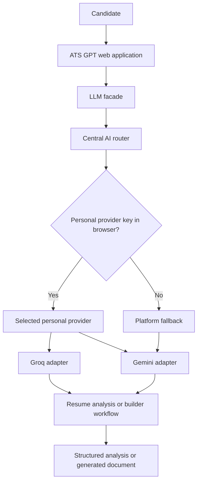
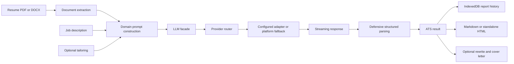

# ATS GPT

ATS GPT is a purpose-built resume intelligence platform for evaluating a resume against a specific job description and turning the result into practical next steps.

It combines document extraction, ATS-oriented analysis, structured scoring, keyword and skills comparison, configurable evaluation preferences, resume enhancement, cover-letter generation, and PDF resume building in one focused workflow. The product is not designed as a general-purpose chatbot. Its prompts, response schemas, parsing logic, caching, and interface are organized around the decisions people make when applying for a job.

> **Resume Intelligence, Operationalized**

[](LICENSE)

## Product Overview

ATS GPT helps a candidate answer four concrete questions:

1. How closely does my resume align with this job description?
2. Which keywords and skills are missing or underrepresented?
3. What specific improvements should I make without inventing experience?
4. Can I produce a cleaner, ATS-friendly resume and optional cover letter from the same source material?

The application supports two complementary product modes:

- **Analyze Resume** compares an uploaded resume with a job description and returns a structured analysis.
- **Build Resume** collects information manually or imports a PDF/DOCX, then produces a formatted resume PDF and an optional cover-letter PDF.

## The Problem

The original hosted workflow depended on a single shared platform API key. That was useful for development and early usage because a fast hosted inference provider made the first version easy to operate. It also created a predictable operational bottleneck:

- **Shared rate limits:** every request competed for the same provider allocation.
- **Finite free-tier usage:** a busy application could exhaust the available quota.
- **Unreliable availability:** a quota failure appeared at the exact moment a candidate needed feedback.
- **Poor failure recovery:** a generic AI error did not explain what the user could do next.
- **Provider coupling:** analysis logic became too dependent on one transport and one provider contract.

The engineering question was therefore larger than “how do we call an AI API?” It was: how do we keep the resume workflow specialized and useful while making provider selection explicit, failures understandable, and future provider changes inexpensive?

## Solution: A Provider-Aware AI Architecture

ATS GPT separates the resume domain layer from the provider transport layer.

The resume analyzer and builder ask the LLM facade for a completion. The centralized router then chooses the active provider according to the user's browser configuration and the platform fallback configuration.

Current routing priority:

1. A personal provider key saved in the browser, if configured.
2. The platform AI fallback when no personal key exists.

The application currently supports Groq and Gemini provider adapters. The deployed platform fallback is Gemini. The provider abstraction keeps the rest of the application independent from those provider-specific request formats.



### New user

A new visitor can use the platform fallback without entering a key:

```text
New visitor
    -> no personal provider configuration
    -> platform AI fallback
    -> resume analysis or builder request
```

### Personal provider configuration

The Settings flow validates a personal key before saving it:

```text
Settings
    -> choose a supported provider
    -> enter API key
    -> Test Connection
    -> save the validated configuration in this browser
    -> use that provider for future requests in this browser
```

The saved configuration survives normal page reloads because it is stored in `localStorage`. It is not currently associated with an authenticated account.

### Returning user

A returning user on the same browser profile loads the saved provider configuration automatically. Clearing the browser storage, using a different browser profile, or using another device does not currently carry that configuration over.

## Current Persistence and Security Model

This repository is a static frontend application. It does **not** currently include authentication, a server API, or a database-backed user account system.

That distinction matters:

- Personal provider settings are stored in browser `localStorage` under `ats-buddy:ai-provider-config`.
- The stored credential is lightly obfuscated at rest and is never displayed in full; this is not encryption and cannot protect a user from someone who can inspect that browser profile.
- The raw personal key is held in memory when requests are made and is sent directly to the selected provider from the browser.
- Analysis history is stored in browser IndexedDB under the `ats-buddy` database. It is local to that browser profile.
- The current platform Gemini credential is present in the client bundle through `src/services/aiRouter.ts`, which means it should be treated as public and quota-limited rather than as a secret.
- No authenticated user isolation exists in the current implementation. Browser-profile separation is not equivalent to account-level isolation.

This is an intentional privacy tradeoff for a static client application, but it is also the principal security limitation of the current deployment. A production multi-user architecture should move provider credentials and the platform credential behind a server-side API, associate configuration with an authenticated user ID, encrypt secrets with a managed key service, and never return raw credentials to the browser.

## Intelligent Rate-Limit Handling

Provider errors are normalized into application-level error codes in `src/services/aiProvider.ts` and `src/services/aiErrors.ts`. The UI can distinguish an invalid key, a personal-provider quota failure, a platform quota failure, an unavailable provider, and a general request failure.

When the platform quota is exhausted, the application presents a recovery action instead of an opaque failure:

```text
Shared AI capacity reached
    -> Configure AI Provider
    -> validate a personal key
    -> continue with personal provider capacity
```

This does not remove provider limits. It converts a platform-level failure into a clear, user-controlled recovery path and reduces dependence on one shared allocation.

## AI Provider Abstraction

Provider-specific behavior lives behind a small adapter interface:

```text
AIProvider
    |-- GroqProvider
    |-- GeminiProvider
```

Each adapter is responsible for its own request format, streaming response handling, key validation, and provider-specific error translation. The router owns selection and fallback behavior. Resume analysis, enhancement, and resume building remain domain workflows and do not need to know which provider handled a request.

This makes future adapters such as OpenAI or Anthropic possible without claiming that they are implemented today. A new provider would need an adapter, error mappings, configuration UI, and focused tests; the resume workflow itself should not need to be redesigned.

## Resume Intelligence Workflow

### Analysis

The analysis flow is deliberately structured rather than conversational:

1. Read selectable text from a PDF or extract text from an uploaded document.
2. Combine the resume, job description, and optional tailoring preferences.
3. Ask for a defined JSON shape containing missing keywords, missing technical and soft skills, strengths, areas for improvement, suggestions, and a 0-100 compatibility score.
4. Parse defensively and coerce fields into the application's known domain shape.
5. Retry once with a formatting prompt when the response cannot be parsed.
6. Save the report in local IndexedDB and expose Markdown/HTML report downloads.

The tailoring step lets users adjust strictness, detail, focus areas, and notes before analysis. The cache key includes the resume bytes, job description, backend, model, and tailoring settings so changing those inputs cannot return a stale report.

### Enhancement

The enhancement workflow asks for a cover letter and a rewritten resume grounded in the original resume and analysis. It detects truncated output, attempts a continuation, and can request the missing resume section separately when a model returns only a cover letter.

The prompts explicitly prohibit invented employers, credentials, dates, and unsupported metrics. This is a product requirement, not just a prompt preference: a polished but fabricated resume is worse than an incomplete one.

### Resume builder

The builder has two entry paths:

- **Manual entry:** personal information, target role, experience, projects, education, skills, certifications, notes, and optional job description.
- **Import:** PDF or DOCX text extraction followed by structured resume generation.

The builder requests a compact structured JSON object, normalizes common model variations, retries once on parsing failure, and renders a single-page resume PDF in the browser. An optional cover letter is rendered as a separate PDF.

## Why ATS GPT Is Specialized

General-purpose models can discuss resumes, but ATS GPT is organized around a specific evaluation workflow. Its domain-focused prompts and structured output contract make the product reason about:

- job-description keywords
- technical and soft skills
- evidence in the candidate's actual resume
- experience alignment
- strengths and gaps
- actionable improvements
- overall resume/job compatibility
- ATS-readable output structure

The project has been iteratively refined against representative sample resumes and job descriptions. The repository does not contain foundation-model training or fine-tuning code, so this README does not claim that ATS GPT trained a model. The specialization comes from prompt design, response schemas, parsing, evaluation workflow, and product constraints around truthful resume rewriting.

## End-to-End Architecture



## Features

- Resume upload for PDF and DOCX workflows
- PDF text extraction with bundled pdf.js assets
- DOCX text extraction without a separate server
- Resume/job-description compatibility scoring
- Missing keyword analysis
- Missing technical and soft-skill analysis
- Strengths and areas-for-improvement sections
- Actionable suggestions with fallback guidance when fewer than three are returned
- Optional tailoring controls for strictness, detail, focus, and notes
- Resume enhancement and cover-letter generation
- Manual resume builder with structured fields
- PDF resume generation and optional cover-letter PDF generation
- Browser-local report history with clear-history controls
- Markdown and standalone HTML report downloads
- Groq and Gemini provider adapters
- Personal provider key validation and masked display
- Platform fallback routing
- Normalized invalid-key, quota, network, and request errors
- In-browser WebLLM option for supported WebGPU environments
- Local server option for a reachable compatible inference server
- Responsive React interface with animated introduction and workflow transitions

## Technology Stack

| Area | Technology used |
| --- | --- |
| UI | React 19 with TypeScript |
| Build and dev server | Vite 8 |
| Styling | Tailwind CSS 4 with `@tailwindcss/vite` |
| Motion | Motion library (`motion/react`) |
| AI providers | Gemini and Groq HTTP adapters |
| Browser-local inference | `@mlc-ai/web-llm` and WebGPU |
| Document processing | `pdfjs-dist`, browser APIs, bundled pdf.js assets |
| Persistence | IndexedDB for reports; `localStorage` for browser settings |
| Testing | Vitest, Testing Library, jsdom, fake-indexeddb |
| Deployment | Vercel; also compatible with static hosting when configured appropriately |

There is no backend framework, authentication service, hosted database, or server-side secret manager in this repository.

## Repository Structure

```text
ats-buddy/
├── public/
│   └── pdfjs/                  Bundled pdf.js fonts and character maps
├── scripts/
│   └── copy-pdfjs-assets.mjs   Copies required pdf.js assets before dev/build
├── samples/
│   ├── job_descriptions/       Example target postings
│   └── resumes/                Example resumes for manual testing
├── src/
│   ├── components/             React UI, builder, picker, results, and motion
│   ├── hooks/                  Backend and analysis orchestration hooks
│   ├── services/
│   │   ├── aiRouter.ts         Provider selection and platform fallback
│   │   ├── aiProvider.ts       Provider abstraction and error translation
│   │   ├── gemini.ts           Gemini transport and streaming parser
│   │   ├── groq.ts             Groq transport and streaming parser
│   │   ├── analyze.ts          Analysis and enhancement workflows
│   │   ├── resumeBuilder.ts    Structured resume generation and PDF rendering
│   │   ├── resumeImport.ts     Resume import and extraction helpers
│   │   ├── parse.ts             Defensive analysis response parsing
│   │   ├── prompts.ts           Domain prompts and JSON schemas
│   │   ├── pdf.ts               PDF extraction and rendering support
│   │   ├── report.ts            Markdown and HTML report rendering
│   │   └── db.ts                IndexedDB report persistence
│   ├── wizard/                 Workflow steps and navigation rules
│   ├── App.tsx                 Application shell and mode orchestration
│   ├── index.css               Global tokens and styling
│   └── types.ts                Shared TypeScript domain types
├── index.html
├── package.json
├── tsconfig.json
├── vercel.json
└── vite.config.ts
```

## Getting Started

### Prerequisites

- Node.js compatible with the repository's Vite and TypeScript toolchain
- npm
- A Gemini or Groq API key only if using a personal provider configuration
- A modern browser for the deployed or local web application

### Install and run

```bash
git clone <repository-url>
cd ats-buddy
npm install
npm run dev
```

Open the local URL printed by Vite.

### Production build

```bash
npm run build
npm run preview
```

The `predev` and `prebuild` scripts copy the pdf.js assets required by the PDF workflow.

### Environment variables

The current repository does not read a platform API key from an environment variable. The platform fallback is defined in the client-side router, which is a security limitation that should be addressed before operating a high-volume public service.

Personal keys are entered through **Settings -> AI Provider -> Test Connection -> Save** and are stored in the current browser profile. Never commit a real API key to GitHub.

The login gate is prepared for OAuth but requires provider credentials before it can complete a real sign-in. Configure these Vite variables in the deployment environment:

```text
VITE_GOOGLE_CLIENT_ID=your_google_oauth_client_id
VITE_GITHUB_CLIENT_ID=your_github_oauth_client_id
```

Register `/auth/callback.html` as the OAuth callback URL for the deployed origin. Google can return an implicit access token to the browser callback. GitHub's authorization-code flow requires a server-side exchange for production use; the current static app does not yet include that exchange or an authenticated account backend.

### Vercel deployment

From the application directory:

```bash
vercel --prod
```

The included `vercel.json` supplies JavaScript module MIME headers used by the static deployment. The Vite base path is `/` for Vercel and local builds; `DEPLOY_TARGET=pages` switches it to `/ats-buddy/` for a GitHub Pages project site.

## Testing

```bash
npm test
npm run test:watch
npm run test:coverage
npm run typecheck
```

The test suite covers wizard navigation, provider and backend behavior, streaming clients, response parsing, prompt tailoring, report rendering and escaping, cache keys, browser persistence, and component behavior. Network, GPU, and pdf.js-worker paths are mocked or require a browser environment and are not fully represented by jsdom tests.

## Engineering Decisions

### Centralized routing

A single router gives provider selection and error classification one owner. Analysis and builder code stay focused on resume behavior instead of duplicating provider fallback logic.

### Provider adapters

The provider interface isolates request formats and streaming details. This is especially useful because Groq uses an OpenAI-compatible SSE shape while Gemini has its own streaming response format.

### Structured output

Analysis and builder workflows request predictable JSON structures and parse defensively. The system does not assume that every model will follow instructions perfectly; retries and normalization are part of the product design.

### Local persistence

IndexedDB is appropriate for report history because reports can contain substantial text and should remain available without a hosted database. `localStorage` is sufficient for small browser preferences, but it is not an account system.

### Honest failure handling

Provider errors are translated into meaningful states. A rate-limit failure should lead to a recovery instruction, while malformed output should lead to a retry or a precise parsing message.

### Separation of domain and transport

The resume-analysis prompts, scoring shape, enhancement workflow, and PDF renderer should remain stable even when the underlying AI provider changes.

## Security and Production Hardening

The current static architecture is useful for a privacy-oriented personal tool, but it is not a secure multi-tenant credential vault. Before scaling it to many users, the next security boundary should be:

1. Add authentication and associate provider configuration with an account ID.
2. Move AI requests behind a server-side API or edge function.
3. Store platform and personal credentials only in protected server-side storage.
4. Encrypt provider credentials with a managed key service.
5. Never return raw credentials to the frontend.
6. Add per-user authorization checks, quota accounting, abuse controls, and audit logging.
7. Rotate the currently exposed platform credential and move it out of the client bundle.

These are future hardening steps, not capabilities provided by the current repository.

## Future Improvements

- Server-side credential vault and authenticated user accounts
- Additional provider adapters
- Per-user usage and quota visibility
- More advanced resume/job evidence matching
- Resume version tracking and comparison
- Automated benchmarking against a maintained evaluation set
- More detailed ATS simulation and formatting diagnostics
- Team or company workspaces
- Usage analytics with privacy-preserving controls
- Better import support for additional document formats
- Browser-based visual regression coverage for animated and PDF workflows

## License

MIT. See [LICENSE](LICENSE).
