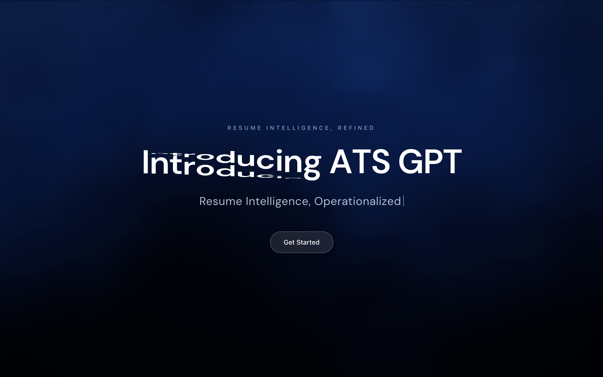
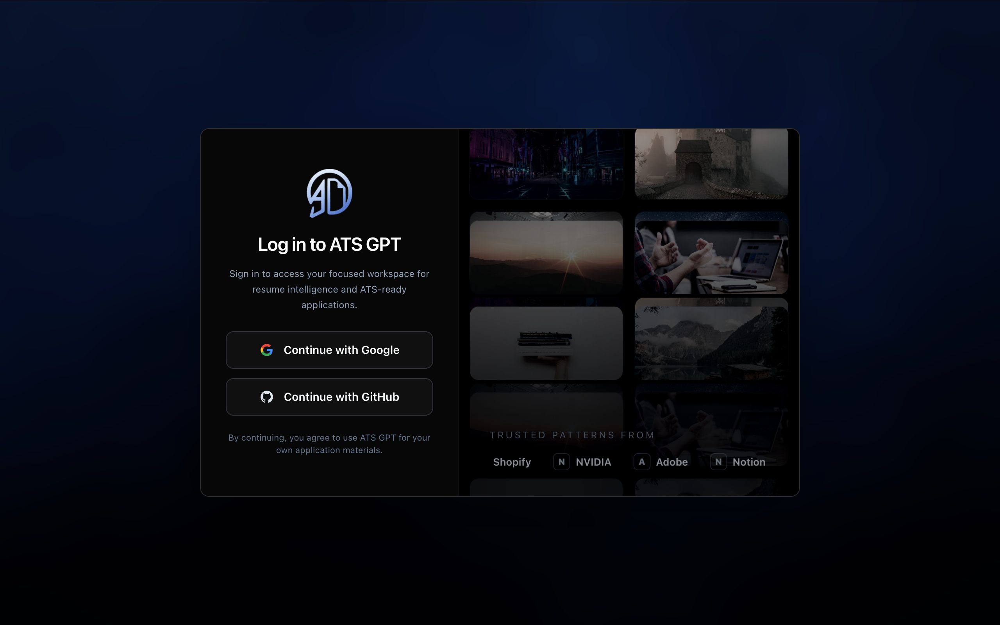
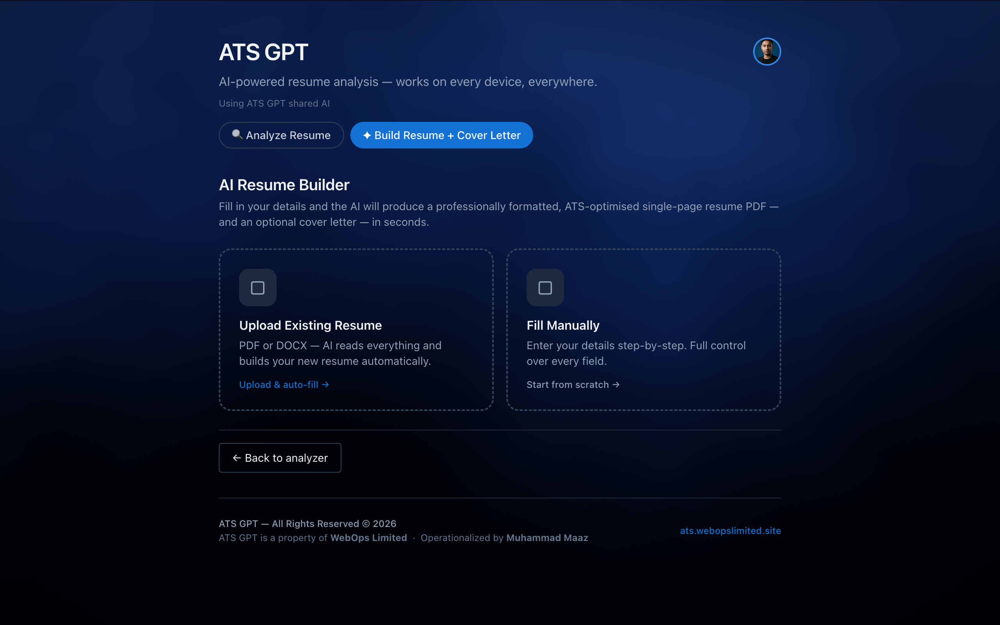
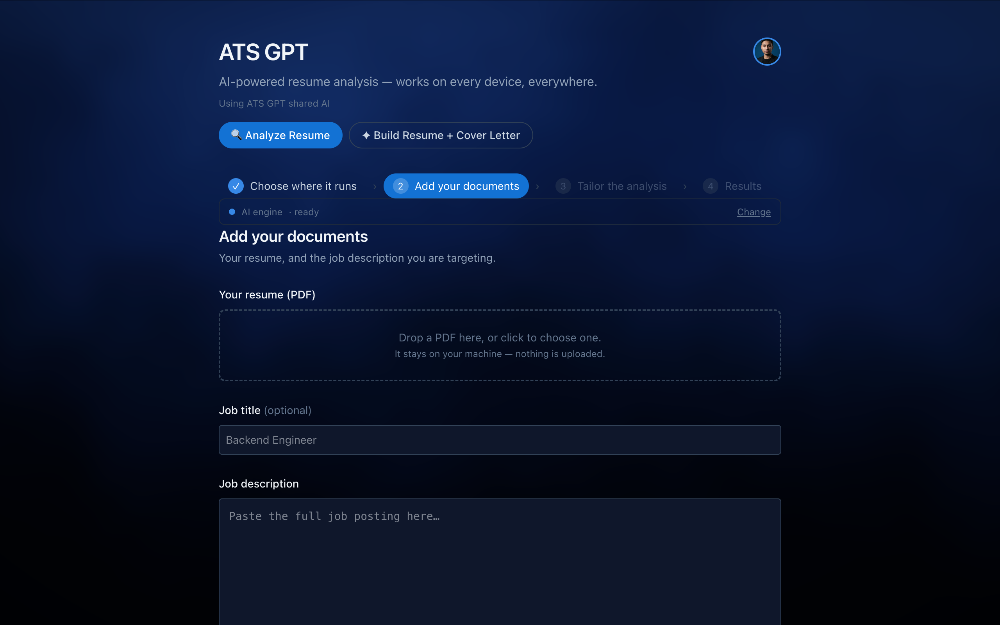
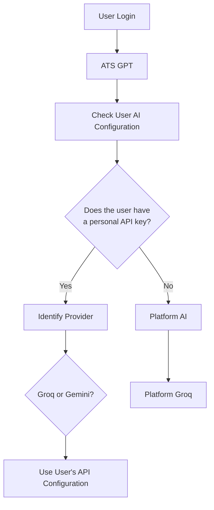
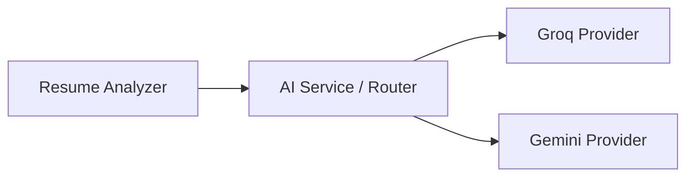

<div align="center">

#  ATS GPT

### AI-powered resume analysis, built around a multi-provider AI architecture.


*Analyzes resumes against job requirements and returns structured, actionable feedback — powered by an architecture where users can bring their own AI provider key. ATS GPT ATS GPT is a purpose-built resume intelligence platform for evaluating a resume against a specific job description and turning the result into practical next steps. It combines document extraction, ATS-oriented analysis, structured scoring, keyword and skills comparison, configurable evaluation preferences, resume enhancement, cover-letter generation, and PDF resume building in one focused workflow. The product is not designed as a general-purpose chatbot. Its prompts, response schemas, parsing logic, caching, and interface are organized around the decisions people make when applying for a job.*

[](LICENSE)
</div>

<br>

## 📚 Table of Contents

- [Preview](#-preview)
- [Introduction](#-introduction)
- [The Problem](#-the-problem)
- [Our Solution](#-our-solution--multi-provider-user-specific-ai-architecture)
- [AI Routing Flow](#-ai-routing-flow)
- [User-Specific API Isolation](#-user-specific-api-isolation)
- [Database & Persistence](#-database--persistence-architecture)
- [API Key Security](#-api-key-security)
- [Rate-Limit Handling](#-intelligent-rate-limit-handling)
- [Provider Abstraction](#-ai-provider-abstraction)
- [Why This Architecture Matters](#-why-this-architecture-matters)
- [Why ATS GPT?](#-why-ats-gpt)
- [Features](#-features)
- [Technology Stack](#-technology-stack)
- [Project Structure](#-project-structure)
- [Setup & Installation](#-setup--installation)
- [User AI Configuration Guide](#-user-ai-configuration-guide)
- [Engineering Decisions](#-key-engineering-decisions)
- [Future Improvements](#-future-improvements)

<br>

## 📸 Preview

<table>
<tr>
<td width="50%">

**Landing**
<br>
<em>Resume intelligence, refined.</em>



</td>
<td width="50%">

**Sign in**
<br>
<em>Google or GitHub OAuth to get into your workspace.</em>



</td>
</tr>
<tr>
<td width="50%">

**AI Resume Builder**
<br>
<em>Upload an existing resume to auto-fill, or start from scratch.</em>



</td>
<td width="50%">

**Analyze Resume**
<br>
<em>Step 2 of the guided flow — add your resume and target job description.</em>



</td>
</tr>
</table>

> Screenshots live in `./screenshots/` — keep that folder alongside `README.md` in the repo root so the images render on GitHub.

<br>

## 🎯 Introduction

**ATS GPT** is an AI-powered resume analysis and ATS (Applicant Tracking System) optimization platform. It analyzes resumes against job requirements and returns structured, actionable feedback — not a free-form chat response, but a focused evaluation built around how real ATS pipelines and hiring workflows actually assess candidates.

The goal was never to build "another AI chatbot." It was to build a **specialized resume intelligence system** — optimized specifically around resume analysis, ATS compatibility scoring, job-description matching, and concrete improvement recommendations.

To make that system sustainable at scale, ATS GPT is built around a model where users can rely on the platform's built-in AI access **or** bring their own AI provider API key. That architectural decision is the core engineering story of this project — and the reason this README exists in the form it does.

<br>

## ⚠️ The Problem

Early versions of ATS GPT relied entirely on a **single shared platform-level Groq API key** to power all resume analysis. That worked fine during development, but it doesn't scale as a permanent architecture. Four specific problems emerged:

| # | Problem | Why it hurts |
|---|---|---|
| 1 | **Rate limits** | One shared key means every user competes for the same request budget |
| 2 | **Limited free usage** | The shared/free-tier quota is finite and can be exhausted entirely |
| 3 | **Scalability ceiling** | A single key serving unlimited users doesn't scale — more users means less reliable access for everyone |
| 4 | **Poor UX on failure** | Without a fallback, quota exhaustion becomes a raw, unexplained error for the user |

> **In short:** the application's availability was coupled to a single external resource it didn't control. That coupling had to be broken.

<br>

## 🏗️ Our Solution — Multi-Provider, User-Specific AI Architecture

Instead of forcing the entire application to depend on one shared API key, ATS GPT introduces a **user-specific AI provider architecture**. Each authenticated user can have their own, independent AI configuration.

| Configuration | Description |
|---|---|
| 🟢 **Platform-provided AI** | Default state — uses the platform's shared Groq configuration |
| 🔑 **User-provided Groq key** | User supplies their own Groq API key |
| 🔑 **User-provided Gemini key** | User supplies their own Gemini API key |

> **Core idea:** every user's AI configuration is independent. One user's API key is never shared with, or accessible to, another user.

This directly eliminates the shared-key bottleneck while keeping ATS GPT fully usable for anyone who hasn't configured anything — the platform key remains the default fallback.

<br>

## 🔀 AI Routing Flow

At the center of the architecture is an **AI Router** that decides, per request, which provider and which credentials to use — based on the authenticated user, not a global setting.



<details>
<summary><b>Scenario A — New User</b></summary>
<br>

```
New User → No personal AI configuration
         → Use platform-provided Groq configuration
         → Resume analysis works normally
```

A new user configures nothing. Resume analysis works out of the box using the platform's default Groq configuration.
</details>

<details>
<summary><b>Scenario B — User Adds Their Own API Key</b></summary>
<br>

```
User → Settings → Select Groq / Gemini → Enter API Key
     → Validate API Key → Securely store configuration
     → Associate configuration with authenticated user
```

Once saved, that user's AI requests route through their own configured provider from then on — no re-entry required on future sessions.
</details>

<details>
<summary><b>Scenario C — Returning User</b></summary>
<br>

```
Login → Identify authenticated user → Load user's AI configuration
      → Personal provider exists → Use previously configured provider
```

Configuration persists across sessions, tied to the authenticated user's account — not a browser, device, or IP address.
</details>

<br>

## 🔒 User-Specific API Isolation

One of the most important technical properties of the system: **API configurations belong to the authenticated user, not the application as a whole.**

```
User A
 └── Groq configuration A

User B
 └── Gemini configuration B

User C
 └── No personal configuration
     └── Platform AI (fallback)
```

- If **User A** configures a Groq key, only User A's requests use it.
- **User B cannot see, use, or access User A's key** — there is no shared credential surface between accounts.
- If **User B** configures a Gemini key independently, their requests route through Gemini while User A's continue through Groq.
- **User C**, having configured nothing, falls back to the platform's shared Groq configuration.

Multiple users can use different providers — or none at all — **simultaneously**, without any cross-user interference.

<br>

## 🗄️ Database / Persistence Architecture

Each user's AI configuration is persisted as a record tied to their authenticated account:

| Field | Purpose |
|---|---|
| `userId` | Links the configuration to a specific authenticated account |
| `provider` | Which provider this configuration targets (Groq / Gemini) |
| `encryptedApiKey` | The user's API key, stored using server-side encryption — never in plaintext |
| `isActive` | Whether this configuration is currently in use |
| `createdAt` | When the configuration was first saved |
| `updatedAt` | When it was last modified |

> 🔐 API credentials are **never stored in plaintext**. They're protected via server-side encryption and never exposed to the frontend after being saved.
>
> 🪪 The **authenticated user's account/session identifier is the primary association mechanism** — not an IP address. IP data, where captured, is auxiliary audit metadata only, never the ownership mechanism for a key.

<br>

## 🛡️ API Key Security

User-provided API keys are sensitive credentials, and the architecture treats them accordingly:

- ✅ Handled **server-side only** — never exposed in frontend code or client bundles
- ✅ Never returned to the frontend in plaintext after being saved
- ✅ Stored **encrypted at rest**
- ✅ The platform's own API key stays server-side, never exposed to any client
- ✅ **User A's credentials cannot be retrieved by User B** — isolation enforced at the data layer
- ✅ Never committed to source control — platform credentials live in environment variables/secrets
- ✅ Validated before saving, where supported (a lightweight test call before persisting)

In the UI, saved keys are always shown masked:

```
Groq
gsk_••••••••••••7K9P
✓ Connected
```

<br>

## ⚡ Intelligent Rate-Limit Handling

When the platform's shared AI quota is exhausted, ATS GPT doesn't surface a raw provider error — it detects the failure and responds with something actionable:

> **"Our shared AI capacity has reached its current limit. You can continue using ATS GPT by connecting your own Groq or Gemini API key in Settings."**
>
> `[ Configure AI Provider ]`

This turns a platform-level limitation into something the user can resolve immediately, and reduces the app's dependency on a single shared free-tier allocation as the *only* path to availability.

<br>

## 🧩 AI Provider Abstraction

Resume analysis is intentionally **not tightly coupled** to any single AI provider. A centralized AI service sits between the resume analyzer and the underlying providers:



The resume analyzer asks the AI service to perform an operation — it doesn't need to know or care whether that request is served by Groq or Gemini. This keeps the system maintainable and means additional providers could be integrated later **without redesigning the resume-analysis engine itself**.

> No additional providers are implemented today — this describes the extensibility the abstraction enables, not current functionality.

<br>

## 📈 Why This Architecture Matters

| Property | What it means for ATS GPT |
|---|---|
| **Scalability** | Users bring their own provider credentials instead of consuming one shared allocation |
| **Reliability** | If the shared platform quota drops, users have an immediate alternative |
| **User Control** | Users choose which supported AI provider powers their analysis |
| **Provider Flexibility** | The app isn't permanently locked to a single AI vendor |
| **Isolation** | Each user's configuration and credentials are fully independent |
| **Cost Management** | Shared access by default, with headroom via user-provided credentials |
| **Long-Term Architecture** | The abstraction layer makes future AI integrations lower-risk |

<br>

## 🌟 Why ATS GPT?

ATS GPT isn't positioned as objectively "better" than general-purpose AI chat tools — that's not a meaningful claim. The real differentiation is **specialization**:

> General-purpose AI models are designed to answer a broad range of questions. ATS GPT is designed around a focused resume-analysis workflow.

Rather than being trained or fine-tuned as a foundation model, ATS GPT's behavior comes from **specialized prompting and structured evaluation logic** — iteratively refined and tested against representative/sample resumes and job descriptions, organized around the dimensions that actually matter for ATS-style evaluation:

`Resume structure` · `ATS compatibility` · `Job-description matching` · `Skills identification` · `Keyword relevance` · `Experience alignment` · `Strengths & weaknesses` · `Missing information` · `Actionable recommendations` · `Overall alignment`

This produces structured, consistent, resume-specific feedback — instead of the open-ended output you'd get from asking a general-purpose chatbot the same question.

<br>

## ✨ Features

<table>
<tr><td width="200"><b>🧠 Core Analysis</b></td><td>

- Resume upload & parsing
- AI-powered resume analysis
- ATS compatibility scoring
- Job-description matching
- Skills & keyword analysis
- Strengths / weaknesses breakdown
- Actionable improvement suggestions

</td></tr>
<tr><td><b>🔑 AI Configuration</b></td><td>

- User-specific AI provider configuration
- Groq integration
- Gemini integration
- API-key validation before save
- Persistent, per-user provider configuration
- Rate-limit detection & graceful fallback messaging

</td></tr>
<tr><td><b>🖥️ Platform</b></td><td>

- Authentication
- Dashboard
- Settings
- Responsive UI

</td></tr>
</table>

> Review this list against the actual repository and remove anything not currently implemented.

<br>

## 🛠️ Technology Stack

| Layer | Technology |
|---|---|
| **Frontend** | React + TypeScript |
| **Styling** | CSS |
| **AI Providers** | Groq API, Google Gemini API |
| **Backend** | *(add your backend framework here)* |
| **Database** | *(add your database here)* |
| **Authentication** | *(add your auth approach here)* |
| **File Processing** | *(add your resume-parsing library here)* |
| **Deployment** | *(add your hosting platform here)* |

> ✅ Frontend confirmed: **React, TypeScript, CSS**.
> ⚠️ The remaining rows are placeholders — fill in the backend, database, auth, and deployment details that actually exist in this repository before publishing.

<br>

## 📁 Project Structure

> ⚠️ Placeholder — replace with the real repository layout. Shown below is a typical layout for a React + TypeScript frontend.

```
ats-gpt/
├── src/
│   ├── components/       # Reusable UI components (.tsx)
│   ├── pages/            # Top-level views/routes
│   ├── services/
│   │   ├── ai/           # AI router + provider adapters (Groq, Gemini)
│   │   └── resume/       # Resume parsing & analysis logic
│   ├── hooks/            # Custom React hooks
│   ├── types/            # Shared TypeScript types/interfaces
│   ├── styles/           # CSS files
│   ├── App.tsx
│   └── index.tsx
├── public/
├── .env.example
├── tsconfig.json
├── package.json
└── README.md
```

<br>

## 🚀 Setup & Installation

> ⚠️ Placeholder — verify variable names and commands against the actual repo before publishing.

**1. Clone the repository**

```bash
git clone https://github.com/your-org/ats-gpt.git
cd ats-gpt
```

**2. Install dependencies**

```bash
npm install
```

**3. Configure environment variables**

Create a `.env` file based on `.env.example`:

```env
# Platform AI provider (fallback for users without a personal key)
GROQ_API_KEY=your_platform_key_here

# Database
DATABASE_URL=your_database_connection_string

# Authentication
AUTH_SECRET=your_auth_secret_here

# Encryption key used to encrypt stored user API credentials
CREDENTIAL_ENCRYPTION_KEY=your_encryption_key_here
```

> Never commit a `.env` file or real API keys to source control.

**4. Start the development server**

```bash
npm start
```

**5. Build for production**

```bash
npm run build
```

<br>

## 🔧 User AI Configuration Guide

Any authenticated user can connect their own AI provider from **Settings**:

```
Settings → AI Provider → Select Groq or Gemini
         → Enter API Key → Test Connection → Save
```

Once saved, the configuration is tied to that specific authenticated user's account — no need to re-enter it on future logins. The AI Router automatically loads and uses it for all subsequent resume-analysis requests.

<br>

## 🧠 Key Engineering Decisions

| Decision | Why it matters |
|---|---|
| **Centralized AI routing** | One router owns provider selection instead of scattering the logic across the codebase — auditable and easy to extend |
| **User-specific provider configuration** | Tying configuration to the authenticated user (not session/device/IP) makes isolation correct and durable across logins |
| **Server-side API-key handling** | Credentials never touch the frontend after being saved, removing a whole class of client-side exposure risk |
| **Provider abstraction over direct integration** | The resume analyzer talks to an AI service interface, not Groq/Gemini directly — adding a future provider is a contained change, not a rewrite |
| **Persistent, encrypted configuration** | Configuration is stored durably and protected at rest, rather than reconstructed each session |
| **Rate-limit-aware error handling** | Provider quota failures are caught and turned into an actionable message instead of a raw error |
| **Separation of AI logic from analysis logic** | The resume-analysis workflow is independent of *which* provider executes it |

<br>

## 🗺️ Future Improvements

*Planned directions, not current functionality:*

- [ ] Additional AI provider integrations (e.g. OpenAI, Anthropic)
- [ ] More advanced resume/job-description matching logic
- [ ] Resume version tracking and history
- [ ] Usage analytics and provider usage monitoring
- [ ] More detailed, simulation-based ATS scoring
- [ ] Expanded evaluation datasets for prompt refinement
- [ ] Automated benchmarking of analysis quality
- [ ] Team/company account support

<br>

<div align="center">

**ATS GPT** — a purpose-built resume-analysis platform with a specialized AI workflow and a multi-provider architecture designed around real-world API availability, scalability, and user-specific configuration needs.

</div>
